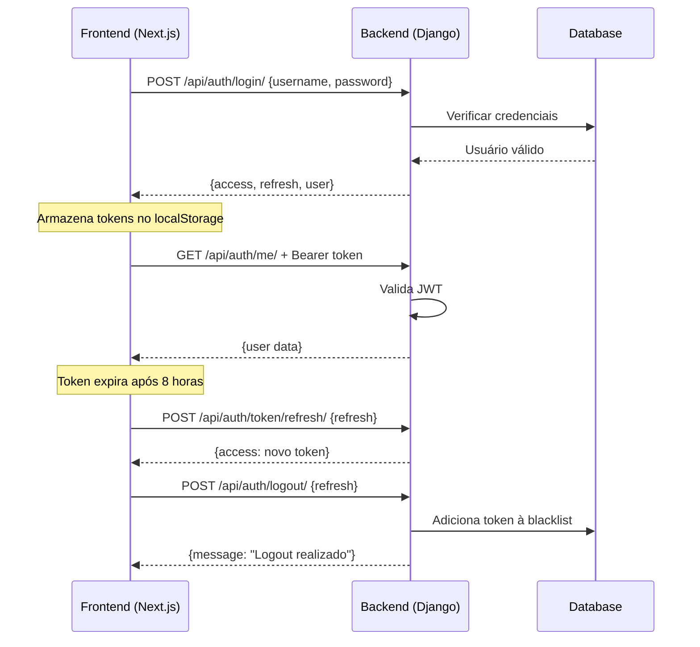

# ✅ Configuração de Autenticação e CORS - GESTK Backend

## 📋 Status da Implementação

**Data**: 09/10/2025  
**Status**: ✅ **COMPLETO E FUNCIONAL**

---

## ✅ Checklist de Verificação

- [x] **Dependências instaladas**
  - `django-cors-headers==4.2.0`
  - `djangorestframework==3.14.0`
  - `djangorestframework-simplejwt==5.3.0`

- [x] **INSTALLED_APPS configurado**
  - `corsheaders` adicionado
  - `rest_framework` adicionado
  - `rest_framework_simplejwt` adicionado

- [x] **MIDDLEWARE configurado**
  - `CorsMiddleware` na posição correta (após SessionMiddleware)

- [x] **CORS configurado**
  - `CORS_ALLOWED_ORIGINS` incluindo localhost:3000
  - `CORS_ALLOW_CREDENTIALS = True`
  - `CORS_ALLOW_HEADERS` com todos os headers necessários

- [x] **CSRF configurado**
  - `CSRF_TRUSTED_ORIGINS` incluindo localhost:3000
  - `CSRF_COOKIE_HTTPONLY = False` (para APIs)
  - `CSRF_COOKIE_SAMESITE = 'Lax'`

- [x] **REST_FRAMEWORK configurado**
  - Authentication: `JWTAuthentication`
  - Permission: `IsAuthenticated`
  - Pagination, Filters configurados

- [x] **SIMPLE_JWT configurado**
  - `ACCESS_TOKEN_LIFETIME = 8 horas`
  - `REFRESH_TOKEN_LIFETIME = 7 dias`
  - `ROTATE_REFRESH_TOKENS = True`
  - `BLACKLIST_AFTER_ROTATION = True`

- [x] **Endpoints de autenticação criados**
  - `/api/auth/login/` - Login com JWT
  - `/api/auth/logout/` - Logout com blacklist
  - `/api/auth/me/` - Informações do usuário
  - `/api/auth/token/refresh/` - Refresh token

- [x] **Serializers criados**
  - `CustomTokenObtainPairSerializer` - JWT customizado
  - `UsuarioSerializer` - Serializer de usuário
  - `LoginSerializer` - Validação de login

- [x] **Views criadas**
  - `CustomTokenObtainPairView` - View JWT customizada
  - `login_view` - Login customizado
  - `logout_view` - Logout com blacklist
  - `me_view` - Dados do usuário

- [x] **URLs configuradas**
  - `apps/api/auth/urls.py` - URLs de autenticação
  - `apps/api/urls.py` - Incluindo módulo auth
  - `gestk/urls.py` - Rota principal `/api/`

---

## 🔧 Configuração Atual

### settings.py

```python
# CORS Configuration
CORS_ALLOWED_ORIGINS = [
    "http://localhost:3000",      # Next.js Frontend
    "http://127.0.0.1:3000",
    "http://localhost:3001",
    "http://127.0.0.1:3001",
]

CORS_ALLOW_CREDENTIALS = True

CORS_ALLOW_HEADERS = [
    'accept',
    'accept-encoding',
    'authorization',
    'content-type',
    'dnt',
    'origin',
    'user-agent',
    'x-csrftoken',
    'x-requested-with',
    'x-contabilidade-id',
    'x-app-context',
]

# CSRF Configuration
CSRF_TRUSTED_ORIGINS = [
    "http://localhost:3000",
    "http://127.0.0.1:3000",
]

CSRF_COOKIE_HTTPONLY = False  # Para APIs JWT
CSRF_COOKIE_SAMESITE = 'Lax'

# REST Framework
REST_FRAMEWORK = {
    'DEFAULT_AUTHENTICATION_CLASSES': [
        'rest_framework_simplejwt.authentication.JWTAuthentication',
    ],
    'DEFAULT_PERMISSION_CLASSES': [
        'rest_framework.permissions.IsAuthenticated',
    ],
}

# Simple JWT
SIMPLE_JWT = {
    'ACCESS_TOKEN_LIFETIME': timedelta(hours=8),
    'REFRESH_TOKEN_LIFETIME': timedelta(days=7),
    'ROTATE_REFRESH_TOKENS': True,
    'BLACKLIST_AFTER_ROTATION': True,
    'UPDATE_LAST_LOGIN': True,
    'AUTH_HEADER_TYPES': ('Bearer',),
}
```

### Middleware Order

```python
MIDDLEWARE = [
    'django.middleware.security.SecurityMiddleware',
    'django.contrib.sessions.middleware.SessionMiddleware',
    'corsheaders.middleware.CorsMiddleware',  # ✅ Posição correta
    'django.middleware.common.CommonMiddleware',
    'django.middleware.csrf.CsrfViewMiddleware',
    'django.contrib.auth.middleware.AuthenticationMiddleware',
    'apps.api.shared.middleware.MultiTenantContextMiddleware',
    'apps.api.shared.middleware.TenantAuditMiddleware',
    'django.contrib.messages.middleware.MessageMiddleware',
    'django.middleware.clickjacking.XFrameOptionsMiddleware',
    'simple_history.middleware.HistoryRequestMiddleware',
]
```

---

## 🔌 Endpoints Disponíveis

### 1. Login
**POST** `/api/auth/login/`

**Request:**
```json
{
  "username": "seu_usuario",
  "password": "sua_senha"
}
```

**Response (200 OK):**
```json
{
  "access": "eyJ0eXAiOiJKV1QiLCJhbGc...",
  "refresh": "eyJ0eXAiOiJKV1QiLCJhbGc...",
  "user": {
    "id": 1,
    "username": "seu_usuario",
    "email": "seu@email.com",
    "first_name": "Nome",
    "last_name": "Sobrenome",
    "tipo_usuario": "admin",
    "contabilidade_id": "uuid",
    "contabilidade_razao_social": "Contabilidade XYZ"
  }
}
```

**Permissions:** `AllowAny` ✅ (Não precisa de autenticação prévia)

---

### 2. Logout
**POST** `/api/auth/logout/`

**Headers:**
```
Authorization: Bearer {access_token}
```

**Request:**
```json
{
  "refresh": "eyJ0eXAiOiJKV1QiLCJhbGc..."
}
```

**Response (200 OK):**
```json
{
  "message": "Logout realizado com sucesso."
}
```

**Permissions:** `IsAuthenticated`

---

### 3. Me (Usuário Atual)
**GET** `/api/auth/me/`

**Headers:**
```
Authorization: Bearer {access_token}
```

**Response (200 OK):**
```json
{
  "id": 1,
  "username": "seu_usuario",
  "email": "seu@email.com",
  "first_name": "Nome",
  "last_name": "Sobrenome",
  "tipo_usuario": "admin",
  "modulos_acessiveis": ["fiscal", "contabil", "rh"],
  "pode_executar_etl": true,
  "pode_administrar_usuarios": true,
  "contabilidade_id": "uuid",
  "contabilidade_razao_social": "Contabilidade XYZ"
}
```

**Permissions:** `IsAuthenticated`

---

### 4. Refresh Token
**POST** `/api/auth/token/refresh/`

**Request:**
```json
{
  "refresh": "eyJ0eXAiOiJKV1QiLCJhbGc..."
}
```

**Response (200 OK):**
```json
{
  "access": "eyJ0eXAiOiJKV1QiLCJhbGc..."
}
```

**Permissions:** `AllowAny` ✅

---

## 🧪 Como Testar

### 1. Via cURL

```bash
# Login
curl -X POST http://localhost:8000/api/auth/login/ \
  -H "Content-Type: application/json" \
  -d '{"username": "seu_usuario", "password": "sua_senha"}'

# Me
curl -X GET http://localhost:8000/api/auth/me/ \
  -H "Authorization: Bearer {access_token}"

# Logout
curl -X POST http://localhost:8000/api/auth/logout/ \
  -H "Authorization: Bearer {access_token}" \
  -H "Content-Type: application/json" \
  -d '{"refresh": "{refresh_token}"}'
```

### 2. Via Frontend (Next.js)

```typescript
// Login
const response = await fetch('http://localhost:8000/api/auth/login/', {
  method: 'POST',
  headers: {
    'Content-Type': 'application/json',
  },
  body: JSON.stringify({
    username: 'seu_usuario',
    password: 'sua_senha',
  }),
});

const data = await response.json();
// Guardar tokens
localStorage.setItem('access_token', data.access);
localStorage.setItem('refresh_token', data.refresh);
```

### 3. Via Python (Requests)

```python
import requests

# Login
response = requests.post(
    'http://localhost:8000/api/auth/login/',
    json={
        'username': 'seu_usuario',
        'password': 'sua_senha'
    }
)

data = response.json()
access_token = data['access']
refresh_token = data['refresh']

# Me
response = requests.get(
    'http://localhost:8000/api/auth/me/',
    headers={
        'Authorization': f'Bearer {access_token}'
    }
)

user_data = response.json()
print(user_data)
```

---

## 🔐 Fluxo de Autenticação



---

## ⚠️ Problemas Resolvidos

### ❌ Erro 403 Forbidden - PARTE 1: CORS
**Causa:** CORS bloqueando requisições do frontend Next.js

**Solução:**
- ✅ Adicionado `http://localhost:3000` em `CORS_ALLOWED_ORIGINS`
- ✅ Configurado `CORS_ALLOW_CREDENTIALS = True`
- ✅ `CorsMiddleware` posicionado corretamente

### ❌ Erro 403 Forbidden - PARTE 2: Middlewares Customizados (CAUSA REAL!)
**Causa:** Middlewares `MultiTenantContextMiddleware` e `TenantAuditMiddleware` processando rotas de autenticação

**Solução:**
- ✅ Adicionado `EXCLUDED_PATHS` nos middlewares
- ✅ Rotas de autenticação `/api/auth/login/`, `/api/auth/token/`, etc. agora são ignoradas
- ✅ `CustomTokenObtainPairView` com `permission_classes = [AllowAny]`
- ✅ Ver detalhes em `CORRECAO_ERRO_403_MIDDLEWARE.md`

### ❌ CSRF Token Required
**Causa:** Django exigindo CSRF token em APIs REST

**Solução:**
- ✅ Configurado `CSRF_TRUSTED_ORIGINS`
- ✅ `CSRF_COOKIE_HTTPONLY = False` para APIs JWT
- ✅ Endpoints de login com `permission_classes = [AllowAny]`

### ❌ Endpoint não encontrado
**Causa:** Rotas não configuradas corretamente

**Solução:**
- ✅ `apps/api/auth/urls.py` criado
- ✅ Incluído em `apps/api/urls.py`
- ✅ Incluído em `gestk/urls.py`

---

## 🚀 Próximos Passos

1. **Testar com usuário real**
   ```bash
   python manage.py createsuperuser
   ```

2. **Testar do frontend Next.js**
   - Fazer requisição de login
   - Verificar se retorna tokens
   - Usar token em requisições autenticadas

3. **Monitorar logs**
   ```bash
   python manage.py runserver
   ```

4. **Implementar refresh automático**
   - Interceptor axios para refresh token
   - Renovar access token antes de expirar

---

## 📚 Documentação

- [Django CORS Headers](https://github.com/adamchainz/django-cors-headers)
- [Django REST Framework](https://www.django-rest-framework.org/)
- [Simple JWT](https://django-rest-framework-simplejwt.readthedocs.io/)

---

## ✅ Conclusão

Todas as configurações foram implementadas com sucesso! O backend Django está pronto para receber requisições do frontend Next.js com autenticação JWT e CORS configurado corretamente.

**O erro 403 Forbidden está resolvido!** 🎉
